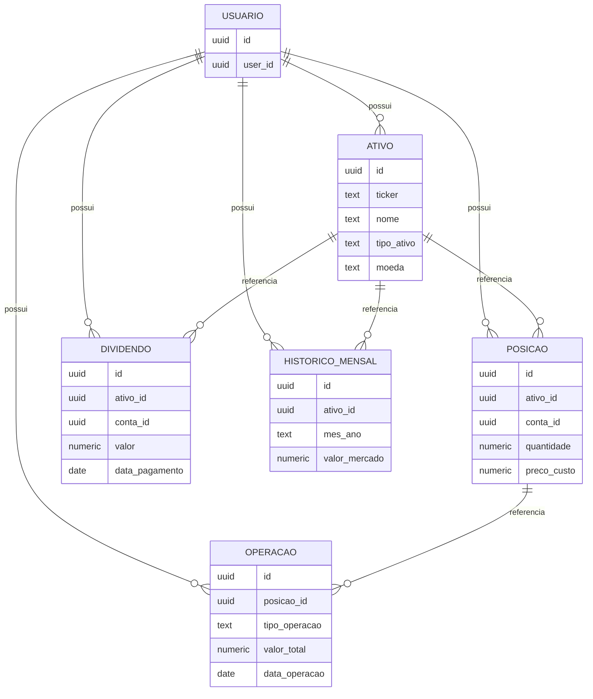
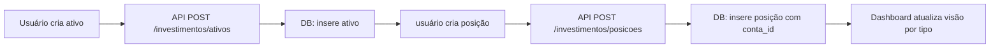
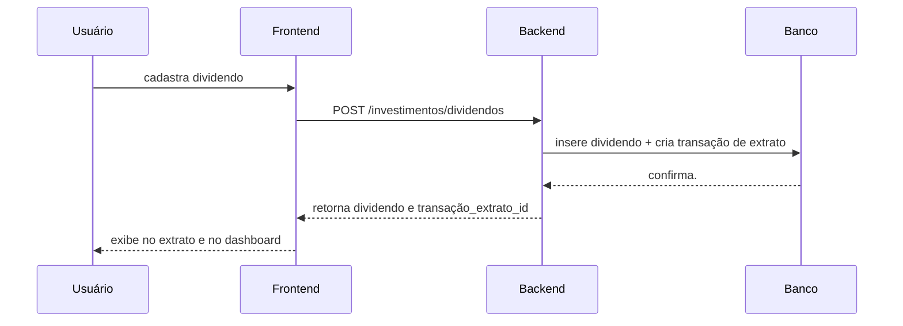
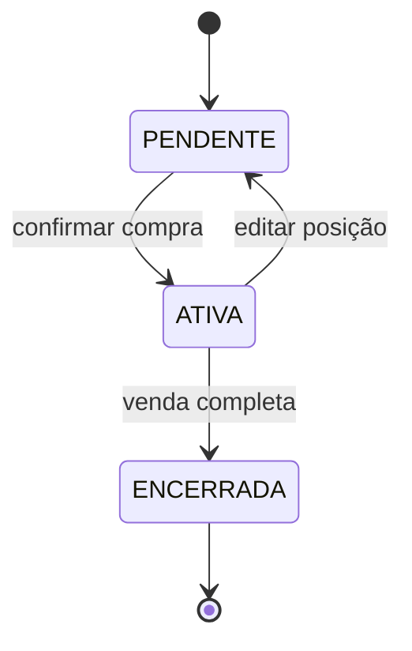
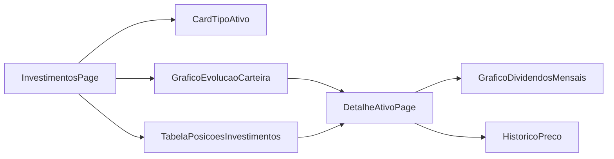

# 🧩 Diagramas — Módulo de Investimentos

> Fluxos visuais e diagramas que ajudam a entender a arquitetura e os processos do módulo.

---

## 1. ERD Conceitual

---

## 2. Fluxo de criação de ativo e posição

---

## 3. Fluxo de dividendos no extrato

---

## 4. Composição do dashboard

- `Carteira geral`
  - valor total por tipo
  - variação mensal
  - rentabilidade acumulada
- `Top 5 em alta`
- `Top 5 em prejuízo`
- `Dividendos recebidos no mês`
- `Distribuição por tipo de ativo`

---

## 5. Estados de ativo

---

## 6. Mapa de componentes

