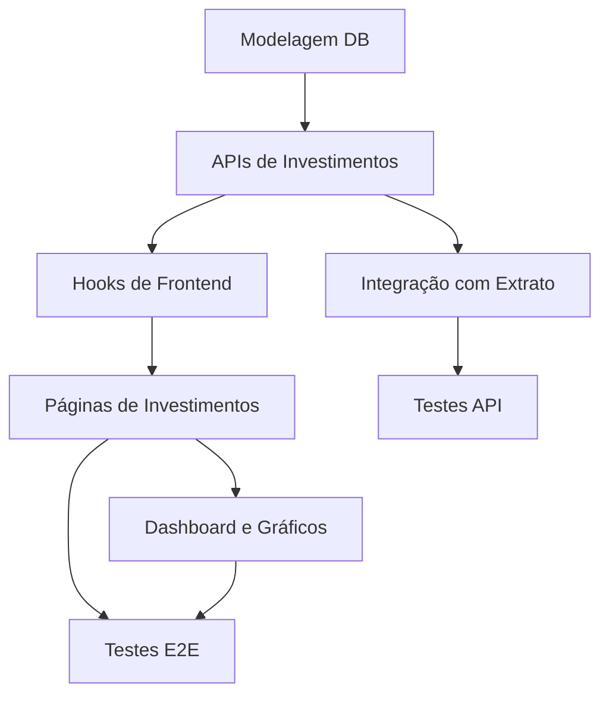

# 🗓️ Timeline e Dependências — Módulo de Investimentos

> Planejamento de execução, dependências e sequência recomendada para o módulo.

---

## 1. Visão geral da timeline

- **Semana 1**: Planejamento, modelagem, migrations e APIs iniciais
- **Semana 2**: Hooks e frontend base
- **Semana 3**: Dashboard analítico e gráficos
- **Semana 4**: Integração com extrato, testes e refinamento

---

## 2. Dependências principais

---

## 3. Ordem recomendada

1. **Modelagem de dados**
   - tabelas
   - RLS
   - migrations
2. **Backend**
   - CRUD de ativos e posições
   - endpoints de dividendos
   - dashboard analítico
3. **Frontend básico**
   - tipos TypeScript
   - hooks de dados
   - páginas de listagem
4. **Dashboard e gráficos**
   - visão por tipo de ativo
   - evolução mensal
   - ranking de performance
5. **Integração com o extrato**
   - transação de dividendos
   - filtros de extrato
6. **Testes**
   - API
   - E2E
   - revisão de usabilidade

---

## 4. Dependências internas e riscos

- `conta_id` obrigatório em posições e dividendos
  - risco: transações sem conta podem quebrar cálculo de saldo
- `tipo_ativo` como filtro central
  - risco: inconsistência de nomenclatura em dados existentes
- dashboard exige agregação por tipo e mês
  - risco: performance em query analítica sem índices
- integração com `arqvalor.transacoes`
  - risco: duplicação ou transações órfãs

---

## 5. Tarefas paralelizáveis

- Backend de CRUD de ativos e backend de dividendos podem ser feitos em paralelo
- Hooks frontend podem ser construídos enquanto o API está em revisão
- Componentes de dashboard podem ser desenvolvidos antes de todos os filtros estarem prontos
- Testes podem começar assim que os endpoints básicos existirem

---

## 6. Checklist de entrega

- [ ] `investimentos.ativos` criado e com RLS
- [ ] `investimentos.posicoes` criado com `conta_id`
- [ ] `investimentos.dividendos` integrado ao extrato
- [ ] dashboard mostra `STOCKS`, `ETF_INTERNACIONAL`, `RENDA_FIXA`, `CRIPTOMOEDAS`, `TESOURO_DIRETO`
- [ ] filtros de tipo funcionando
- [ ] `ExtratoPage` reconhece dividendos
- [ ] testes API covering investment CRUD
- [ ] testes E2E cobrindo fluxo completo

---

## 7. Observação de planejamento

A implementação deve respeitar o padrão de organização do projeto atual: backend em `supabase/functions`, frontend em `FrontEnd/src/`, lógica de domínio em hooks e tipos centralizados em `FrontEnd/src/types/`. A documentação deste módulo deve ser mantida em `projeto_Investimentos/` como referência única para o time.
