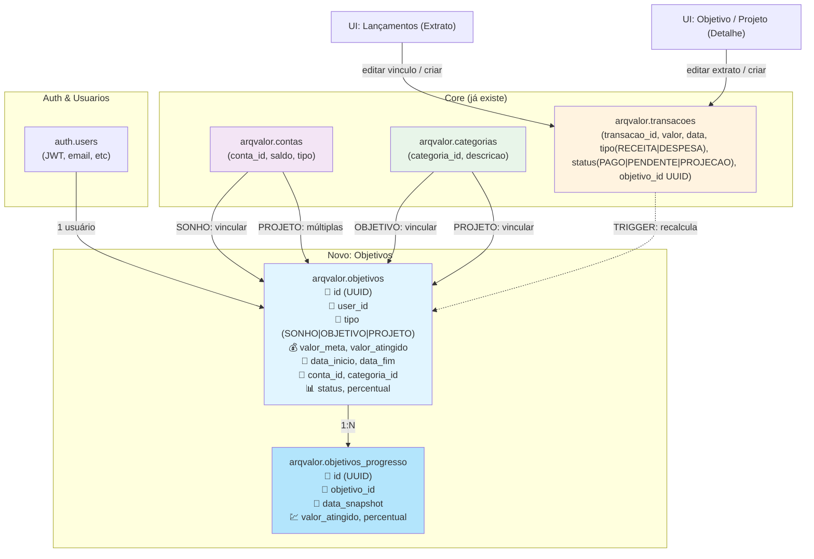
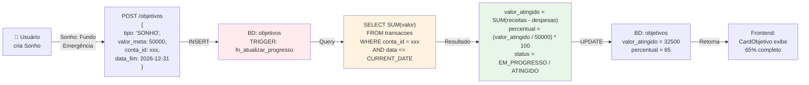
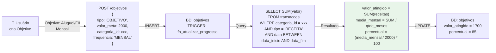
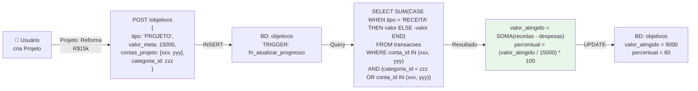
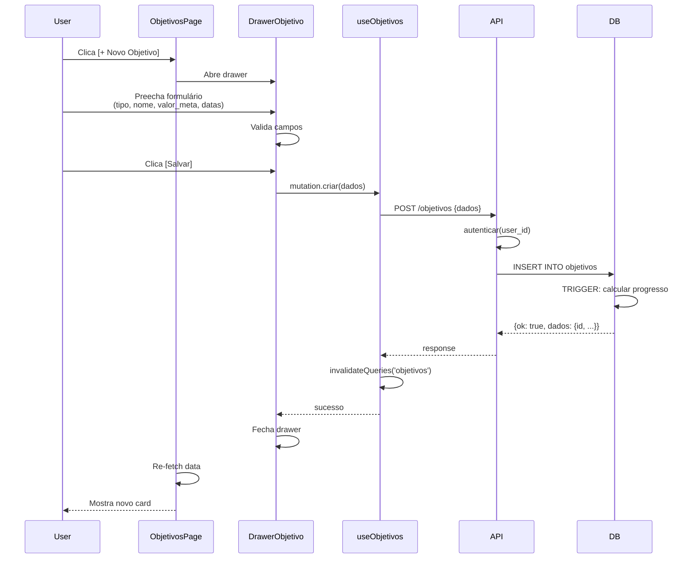
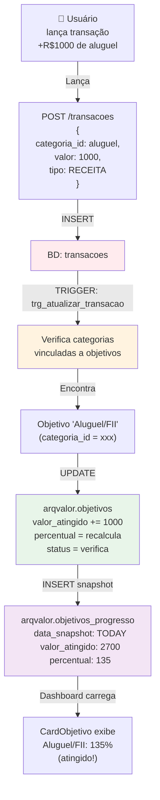
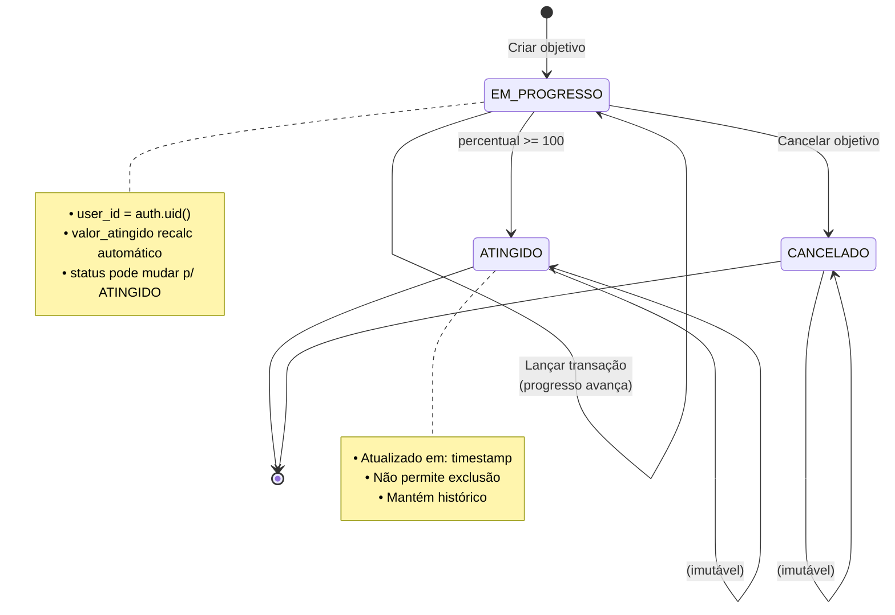
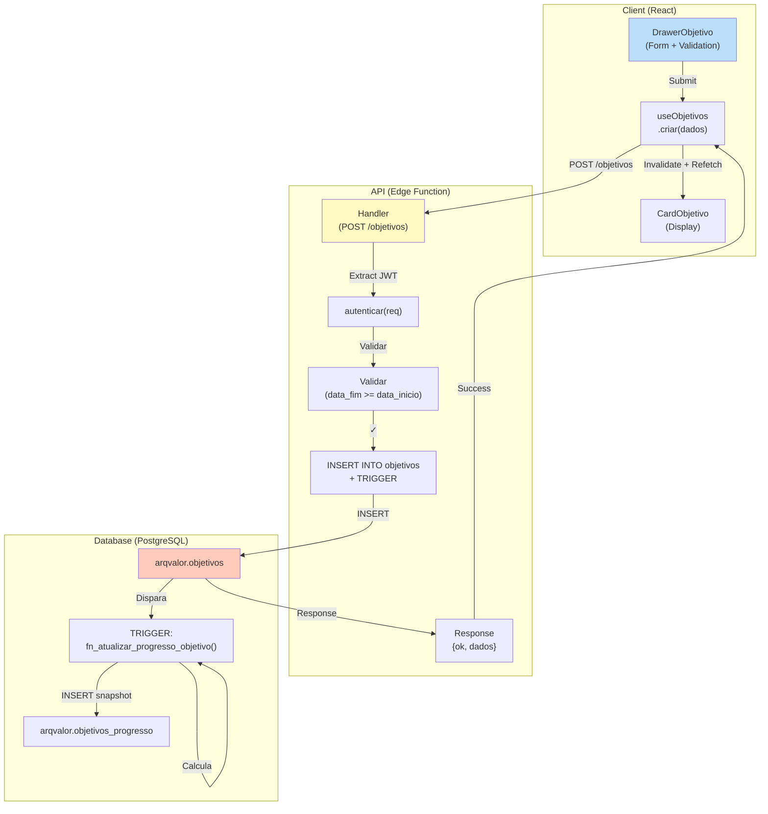
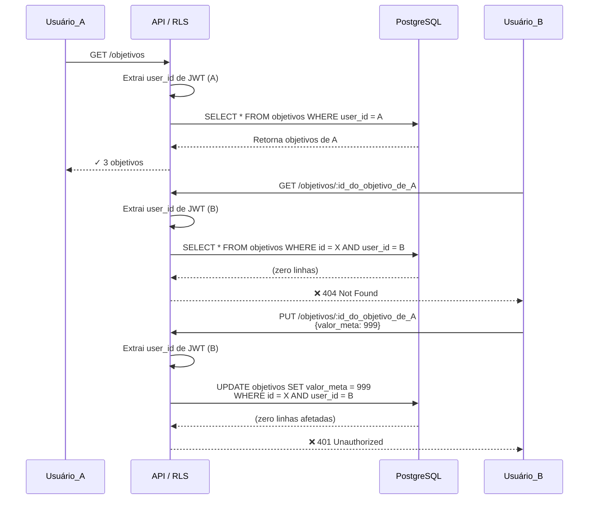
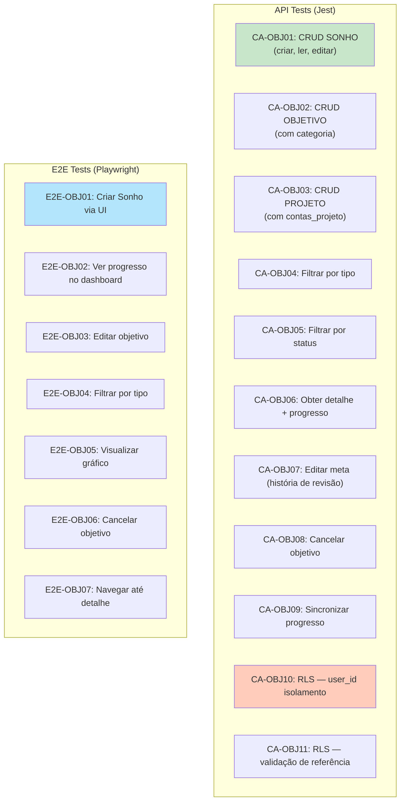

# 📊 Diagramas & Fluxos — Módulo de Objetivos

## 🏗️ Arquitetura de Dados



---

## 🔄 Fluxo de Cálculo de Progresso

### SONHO



### OBJETIVO



### PROJETO



---

## 🎨 Fluxo Frontend — Criar Objetivo



---

## 📈 Fluxo de Progresso — Tempo Real



---

## 🎯 Estados & Transições



---

## 📱 Layout do Dashboard — Mapeamento de Componentes

```
┌─────────────────────────────────────────────────────┐
│  ObjetivoDashboard                                  │
├─────────────────────────────────────────────────────┤
│                                                     │
│  [FiltrosObjetivos]                               │
│   └─ tipo: [SONHO | OBJETIVO | PROJETO]            │
│   └─ status: [EM_PROGRESSO | ATINGIDO | CANCELADO] │
│   └─ periodo: [DateRange]                          │
│                                                     │
├─────────────────────────────────────────────────────┤
│                                                     │
│  SONHOS (3 ativos)          [+ Novo Sonho]         │
│  ┌─────────────────────────────────────────────┐  │
│  │  [CardObjetivo]  [CardObjetivo]  [Card...]  │  │
│  │  • Fundo Emerg.  • Viagem        • Casa     │  │
│  │  • 65%           • 40%           • 15%      │  │
│  └─────────────────────────────────────────────┘  │
│                                                     │
│  OBJETIVOS (2 ativos)       [+ Novo Objetivo]      │
│  ┌─────────────────────────────────────────────┐  │
│  │  [CardObjetivo]  [CardObjetivo]             │  │
│  │  • Aluguel/FII   • Bônus anual              │  │
│  │  • 85%           • 50%                      │  │
│  └─────────────────────────────────────────────┘  │
│                                                     │
│  PROJETOS (1 ativo)         [+ Novo Projeto]       │
│  ┌─────────────────────────────────────────────┐  │
│  │  [CardObjetivo]                             │  │
│  │  • Reforma                                  │  │
│  │  • 60%                                      │  │
│  └─────────────────────────────────────────────┘  │
│                                                     │
├─────────────────────────────────────────────────────┤
│                                                     │
│  📊 Gráfico Consolidado — Últimos 30 dias         │
│  ┌─────────────────────────────────────────────┐  │
│  │ [GraficoProgresso]                          │  │
│  │  • Fundo Emergência (verde) ↗️              │  │
│  │  • Reforma (laranja) ↗️                     │  │
│  │  • Aluguel (azul) ↗️                        │  │
│  │                                             │  │
│  │  Legenda: [✓] Atingidos | [◄] Em progresso│  │
│  └─────────────────────────────────────────────┘  │
│                                                     │
└─────────────────────────────────────────────────────┘
```

---

## 🔌 Endpoint Flow — Criar & Consultar



---

## 🔐 Validação de Isolamento de Usuário (RLS)



---

## 📊 Gráfico de Progresso — Estrutura de Dados

```
GraficoProgresso({
  objetivo_id: 'uuid-xxxx',
  label: 'Fundo de Emergência',
  cor: '#4CAF50',
  dados: [
    { data: '2026-06-01', valor: 30000, percentual: 60 },
    { data: '2026-06-02', valor: 30500, percentual: 61 },
    { data: '2026-06-03', valor: 32500, percentual: 65 },
    ...
  ],
  meta: 50000,
  atingido: false
})

↓

Chart.js:
{
  labels: ['Jun 1', 'Jun 2', 'Jun 3', ...],
  datasets: [{
    label: 'Fundo de Emergência',
    data: [30000, 30500, 32500, ...],
    borderColor: '#4CAF50',
    fill: false,
    tension: 0.1,
    yAxisID: 'y'
  }, {
    label: 'Meta',
    data: [50000, 50000, 50000, ...],
    borderColor: '#FF9800',
    borderDash: [5, 5],
    yAxisID: 'y'
  }],
  options: {
    scales: {
      y: {
        type: 'linear',
        position: 'left',
        title: { text: 'Saldo (R$)' }
      }
    }
  }
}
```

---

## 🧪 Matriz de Testes



---

## 🚀 Checklist de Deploy

### Antes de Merge

- [ ] Migrations criadas e idempotentes
- [ ] ENUMs definidos
- [ ] RLS policies testadas
- [ ] Edge Function `/objetivos` respondendo OK
- [ ] Hooks TypeScript compilando
- [ ] Componentes renderizando
- [ ] Testes API passando (CA-OBJ01..11)
- [ ] Testes E2E passando (E2E-OBJ01..07)
- [ ] Sem erros console (warnings OK)

### Pós-Deploy

- [ ] Dados migrados (se houver staging)
- [ ] RLS ativada em produção
- [ ] Alertas monitorados (Edge Function logs)
- [ ] User feedback coletado
- [ ] Documentação atualizada (CLAUDE.md, se necessário)

---

## 📝 Referências Internas

- [CLAUDE.md](./CLAUDE.md) — padrões frontend + backend
- [ARCHITECTURE.md](./ARCHITECTURE.md) — detalhes de segurança RLS + triggers
- [BUSINESS_RULES.md](./BUSINESS_RULES.md) — regras de recorrência (adaptáveis)
