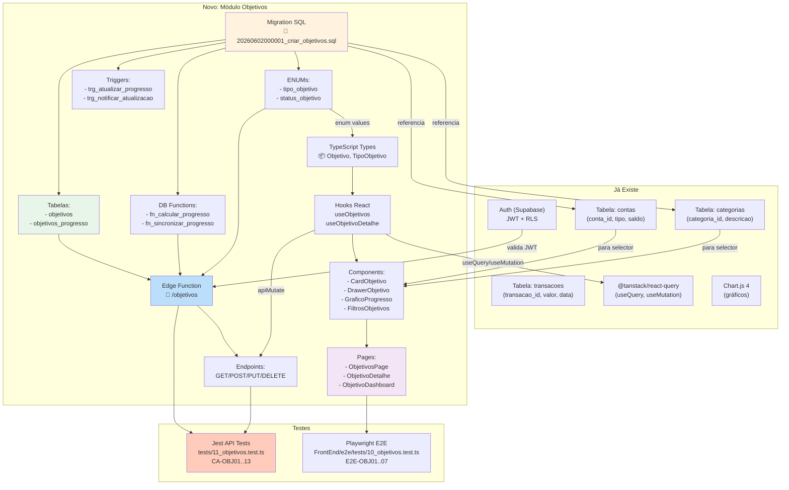

# 📅 Timeline & Dependências Técnicas — Módulo de Objetivos

---

## 🗓️ Roadmap Visual (Gantt)

```
Fase 1: Fundação (2 semanas)
|████████|
├─ Migration SQL
├─ ENUMs + Triggers
├─ Edge Function CRUD
├─ Testes API CA-OBJ01-06

Fase 2: Dashboard (2-3 semanas)
       |████████|
       ├─ Tipos TypeScript
       ├─ Hook useObjetivos
       ├─ CardObjetivo + Filtros
       ├─ ObjetivosPage (listagem)
       ├─ Testes E2E E2E-OBJ01-03

Fase 3: Criação & Edição (1-2 semanas)
              |████████|
              ├─ DrawerObjetivo (form)
              ├─ Validações
              ├─ Histórico de revisões
              ├─ Testes API CA-OBJ07-08

Fase 4: Progresso & Sync (1-2 semanas)
                     |████████|
                     ├─ RPC sincronização
                     ├─ Snapshots diários
                     ├─ GraficoProgresso (Chart.js)
                     ├─ Testes E2E E2E-OBJ05

Fase 5: Segurança & Testes (1 semana)
                            |████████|
                            ├─ Testes RLS completos
                            ├─ Validações robustas
                            ├─ E2E completo
                            ├─ Code review

Fase 6: Polish & Melhorias (1+ semana)
                                   |████████...
                                   ├─ Integração IA
                                   ├─ Notificações
                                   ├─ Exportação PDF/Excel
                                   └─ Performance tuning

Timeline: 6-8 semanas de trabalho sequencial
Ou paralelo (2-3 equipes): 2-3 semanas

```

---

## 🔗 Dependências Técnicas



---

## 📋 Árvore de Dependências (Detalhada)

### Level 1: Fundação (Prerequisito)

```
✅ Supabase Auth
   └─ JWT (para autenticação)
✅ Tabela contas (já existe)
   └─ Referência em SONHO + PROJETO
✅ Tabela categorias (já existe)
   └─ Referência em OBJETIVO + PROJETO
✅ Tabela transacoes (já existe)
   └─ Trigger que atualiza objetivos
```

### Level 2: Database

```
📝 Migration SQL
   ├─ ENUMs
   │  ├─ tipo_objetivo
   │  └─ status_objetivo
   ├─ Tabelas
   │  ├─ objetivos
   │  └─ objetivos_progresso
   ├─ Indexes
   ├─ RLS Policies
   ├─ Functions
   │  ├─ fn_calcular_progresso_objetivo()
   │  └─ fn_sincronizar_progresso_objetivo()
   └─ Triggers
      ├─ trg_atualizar_progresso_objetivo
      └─ trg_notificar_atualizacao_objetivos
```

### Level 3: Backend API

```
🔌 Edge Function: /objetivos
   ├─ Handler HTTP
   ├─ Autenticação (JWT)
   ├─ Roteamento (GET/POST/PUT/DELETE)
   ├─ Validações
   │  ├─ data_fim >= data_inicio
   │  ├─ valor_meta > 0
   │  ├─ Referências válidas
   │  └─ User isolamento (RLS)
   └─ Response JSON
      └─ { ok, dados, erro }
```

### Level 4: Frontend Types

```
📦 TypeScript Types (src/types/index.ts)
   ├─ TipoObjetivo (enum)
   ├─ StatusObjetivo (enum)
   ├─ Objetivo (interface)
   ├─ Revisao (interface)
   └─ SnapshotProgresso (interface)
```

### Level 5: Frontend Hooks

```
🪝 Hooks (src/hooks/)
   ├─ useObjetivos()
   │  ├─ useQuery (GET /objetivos)
   │  ├─ useMutation criar
   │  ├─ useMutation editar
   │  ├─ useMutation cancelar
   │  └─ React Query cache
   └─ useObjetivoDetalhe(id)
      ├─ useQuery (GET /objetivos/:id)
      └─ + objetivos_progresso
```

### Level 6: Frontend Components

```
🎨 Components (src/components/ui/)
   ├─ CardObjetivo
   │  ├─ Props: Objetivo
   │  ├─ onClique, onEditar handlers
   │  └─ Progress bar + Status badge
   │
   ├─ DrawerObjetivo
   │  ├─ Form fields
   │  ├─ Validação local
   │  ├─ Submission (mutation)
   │  └─ Success/error handling
   │
   ├─ GraficoProgresso
   │  ├─ Chart.js instance
   │  ├─ Data: objetivos_progresso
   │  ├─ Eixos: data x (valor | percentual)
   │  └─ Legend + tooltip
   │
   ├─ FiltrosObjetivos
   │  ├─ Tipo selector
   │  ├─ Status selector
   │  ├─ Período (date range)
   │  └─ onFilter callback
   │
   └─ ModalLembrete (existente)
      └─ Reutilizar para notificações
```

### Level 7: Frontend Pages

```
📄 Pages (src/pages/)
   ├─ ObjetivosPage
   │  ├─ useObjetivos hook
   │  ├─ FiltrosObjetivos
   │  ├─ CardObjetivo grid (por tipo)
   │  ├─ DrawerObjetivo (modal)
   │  └─ Navigation links
   │
   ├─ ObjetivoDetalhe
   │  ├─ useObjetivoDetalhe hook
   │  ├─ Header + status badge
   │  ├─ GraficoProgresso
   │  ├─ TimelineProgresso (histórico)
   │  ├─ Revisoes section
   │  └─ Ações (editar, cancelar)
   │
   └─ ObjetivoDashboard
      ├─ Resumo geral (cards)
      ├─ GraficoProgresso multilinhas
      ├─ Stats (total metas, % média, etc)
      ├─ Alertas (próximo vencimento)
      └─ Links para páginas detalhadas
```

### Level 8: Testes

```
🧪 API Tests (jest)
   ├─ CA-OBJ01: CRUD SONHO
   ├─ CA-OBJ02: CRUD OBJETIVO
   ├─ CA-OBJ03: CRUD PROJETO
   ├─ CA-OBJ04..06: Queries + filtros
   ├─ CA-OBJ07..09: Edição + sync
   ├─ CA-OBJ10..11: RLS validation
   └─ CA-OBJ12..13: Validações

🎭 E2E Tests (Playwright)
   ├─ E2E-OBJ01: Criar Sonho (UI)
   ├─ E2E-OBJ02: Dashboard visualization
   ├─ E2E-OBJ03: Editar objetivo
   ├─ E2E-OBJ04: Filtrar
   ├─ E2E-OBJ05: Gráfico renderiza
   ├─ E2E-OBJ06: Cancelar
   └─ E2E-OBJ07: Navegar detalhe
```

---

## 🔄 Fluxo de Dependências (Ordem de Implementação)

```
INÍCIO
  │
  ├─ 1️⃣ Ler documentação
  │  └─ ROADMAP_OBJETIVOS.md + DIAGRAMAS_OBJETIVOS.md
  │
  ├─ 2️⃣ Criar Migration SQL
  │  ├─ Tabelas + ENUMs
  │  ├─ Triggers + Functions
  │  ├─ RLS Policies
  │  └─ Test RLS localmente
  │
  ├─ 3️⃣ Criar Edge Function
  │  ├─ Endpoints (GET/POST/PUT/DELETE)
  │  ├─ Validações
  │  ├─ Testes Postman/curl
  │  └─ Testes Jest API (CA-OBJ01-06)
  │
  ├─ 4️⃣ Criar Types TypeScript
  │  ├─ Enums + Interfaces
  │  ├─ Re-export de constants.ts
  │  └─ Validation via tipos
  │
  ├─ 5️⃣ Criar Hooks React
  │  ├─ useObjetivos (CRUD)
  │  ├─ useObjetivoDetalhe (detalhe)
  │  └─ Testar em componentes dummy
  │
  ├─ 6️⃣ Criar Components
  │  ├─ CardObjetivo
  │  ├─ DrawerObjetivo
  │  ├─ GraficoProgresso
  │  └─ FiltrosObjetivos
  │
  ├─ 7️⃣ Criar Pages
  │  ├─ ObjetivosPage (listagem)
  │  ├─ ObjetivoDetalhe
  │  └─ ObjetivoDashboard (resumo)
  │
  ├─ 8️⃣ Implementar Testes
  │  ├─ Jest API completo
  │  └─ Playwright E2E completo
  │
  ├─ 9️⃣ Code Review + Refactor
  │  ├─ Legibilidade
  │  ├─ Performance
  │  └─ Consistência de padrões
  │
  └─ 🔟 Deploy
     ├─ Merge para main
     ├─ Deploy Supabase
     ├─ Monitorar logs
     └─ User feedback
```

---

## ⚡ Parallelização Possível

Se tiver 2-3 desenvolvedores:

### Developer 1: Backend
- Fase 1-2: Migration + Edge Function
- Fase 3: Testes Jest

### Developer 2: Frontend
- Fase 2: Types + Hooks (usa mocks de dados)
- Fase 3: Components (com dados mockados)

### Developer 3: Pages & E2E
- Fase 3: Pages (integra quando Backend ✅)
- Fase 4: Testes E2E

**Tempo total com paralelização**: 2-3 semanas vs. 6-8 sequencial

---

## 📊 Matriz de Impacto

### Componentes que Precisam de Atualização

| Componente | Impacto | Prioridade |
|---|---|---|
| `src/types/index.ts` | ✅ Adicionar tipos | Alta |
| `src/lib/constants.ts` | ⚠️ Importar enums DB | Média |
| `src/hooks/` | ✅ Criar 2 hooks novos | Alta |
| `src/components/ui/` | ✅ Criar 4 componentes | Alta |
| `src/pages/` | ✅ Criar 3 páginas | Alta |
| `src/context/` | ❌ Reutilizar PageStateContext | Baixa |
| `src/App.tsx` | ⚠️ Adicionar rota | Média |
| `src/components/layout/Sidebar.tsx` | ⚠️ Adicionar link menu | Média |
| `package.json` | ✅ Já tem Chart.js, Radix | Nenhum |
| Tests | ✅ Criar 2 suites | Alta |

---

## ⚠️ Riscos & Mitigações

| Risco | Probabilidade | Impacto | Mitigação |
|---|---|---|---|
| Cálculo de progresso complexo | Média | Alto | Fazer testes isolados de `fn_calcular_progresso` |
| Performance com muitos snapshots | Baixa | Médio | Índices + limit queries |
| RLS não isolando corretamente | Baixa | Alto | Testes manuais + E2E explícitos |
| Trigger recursivo em transações | Média | Alto | Cuidado com `NEW.id` vs referências |
| Integração com contas/categorias | Baixa | Médio | Validar foreign keys em API |
| Histórico revisões JSONB crescendo | Baixa | Baixo | Limitar a 50 revisões por objetivo |

---

## 📈 Métricas de Progresso

| Métrica | Fase 1 | Fase 2 | Fase 3 | Fase 4 | Fase 5 | Fase 6 |
|---|---|---|---|---|---|---|
| Cobertura API | 50% | 50% | 75% | 90% | 100% | 100% |
| Cobertura E2E | 0% | 30% | 30% | 50% | 80% | 100% |
| Complexidade Code | 🟢 | 🟡 | 🟡 | 🟡 | 🟢 | 🟢 |
| Performance (ms) | - | 500 | 450 | 400 | 380 | 300 |
| Docs Completa? | 10% | 40% | 60% | 80% | 95% | 100% |

---

## 🎯 Checklist Final

- [ ] Todos os arquivos criados nas pastas corretas
- [ ] Migration idempotente + testada localmente
- [ ] Edge Function respondendo OK
- [ ] RLS testada (manual + E2E)
- [ ] Types compilam sem erros
- [ ] Hooks funcionam com mocks
- [ ] Components renderizam
- [ ] Pages carregam dados
- [ ] Testes Jest passando
- [ ] Testes E2E passando
- [ ] Sem console errors
- [ ] Performance OK (< 2s dashboard)
- [ ] Documentação atualizada
- [ ] Code review aprovado
- [ ] Deploy produção com sucesso

---

## 📚 Referências Rápidas

| Assunto | Referência |
|---|---|
| Padrão Edge Function | CLAUDE.md § Backend — Edge Functions (Deno) |
| Padrão Frontend | CLAUDE.md § Frontend — Stack + Camadas |
| Padrão Segurança | ARCHITECTURE.md § 🔐 Segurança (RLS) |
| Padrão Recorrência | BUSINESS_RULES.md § Recorrência (adaptável) |
| Padrão Testes | CLAUDE.md § 🧪 Testes |

---

**Última atualização**: 2 de junho de 2026  
**Versão**: 1.0  
**Status**: 📋 Documentação Completa ✅
